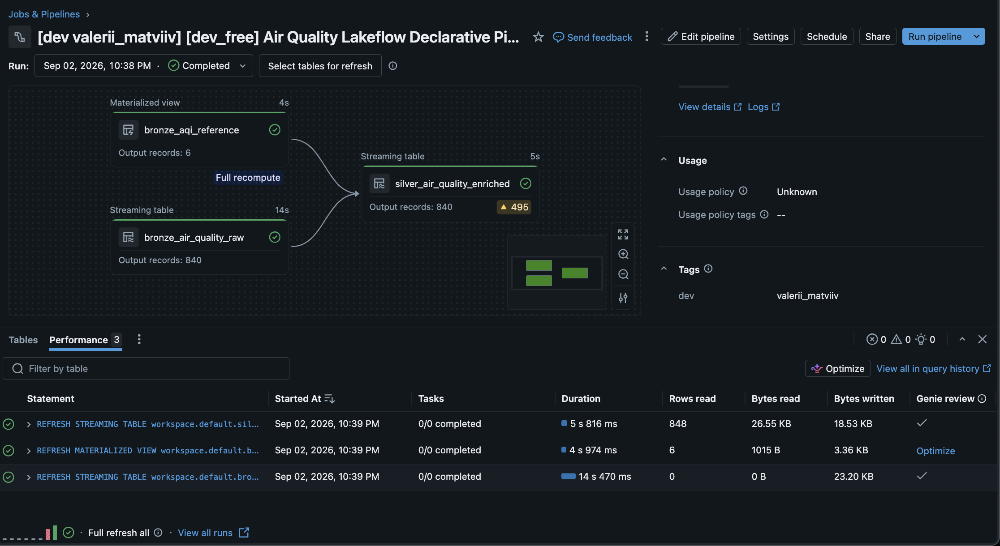

# Classic Spark vs. Declarative Lakeflow Pipelines: Architecture & Trade-off Report

---

## 1. Core Paradigm Shift

| Paradigm | How it Works |
| :--- | :--- |
| **Classic Imperative Spark** | You write **how** to do everything: manually configure `spark.readStream`, manage explicit checkpoint folders, write manual `df.filter()` data checks, trigger micro-batches, and stitch notebooks together with external workflow jobs. |
| **Declarative Lakeflow (DLT)** | You define **what** the data flow and quality expectations should look like (`@dlt.table`, `@dlt.expect`). The engine automatically builds the execution DAG, handles internal state/checkpoints, orchestrates micro-batches, and surfaces lineage and data quality metrics. |

```
+-----------------------------------------------------------------------------------+
|                        CLASSIC IMPERATIVE SPARK PIPELINE                          |
|                                                                                   |
|  [ Landing Files ] ---> [ 01_bronze_notebook ]                                    |
|                                 |                                                 |
|                         (Manual Checkpoint)                                       |
|                                 v                                                 |
|                         [ 02_silver_notebook ] <--- [ Reference CSV ]             |
|                                 |                                                 |
|                   (Manual `if/else` DQ Filters)                                   |
|                                 v                                                 |
|                     [ silver_air_quality Delta ]                                  |
|                                                                                   |
|  * Orchestration: External multi-task Databricks Workflow Job                    |
|  * Checkpoints: Explicitly managed paths on storage                               |
|  * Data Quality: Manual filter() / assert statements                              |
|  * Full Refresh: Manual dbutils.fs.rm() + TRUNCATE TABLE                          |
+-----------------------------------------------------------------------------------+
                                         vs
+-----------------------------------------------------------------------------------+
|                     DECLARATIVE LAKEFLOW PIPELINE (DLT)                           |
|                                                                                   |
|  [ Landing Files ] ---> [ bronze_air_quality_raw ] (Auto Loader)                  |
|                                 |                                                 |
|                        (Managed by Lakeflow)                                      |
|                                 v                                                 |
|  [ Reference CSV ] ---> [ silver_air_quality_enriched ]                           |
|                                 |                                                 |
|                   (@dlt.expect Built-in Rules)                                    |
|                                 v                                                 |
|                     [ Automated Lineage & Metrics ]                               |
|                                                                                   |
|  * Orchestration: Built-in DAG resolved from table functions                      |
|  * Checkpoints: Zero manual path management (state store handled internally)      |
|  * Data Quality: @dlt.expect annotations + real-time UI dashboards                |
|  * Full Refresh: 1-click safe atomic reload                                       |
+-----------------------------------------------------------------------------------+
```

---

## 2. Engineering Critique: What We Gain vs. What We Lose

### The Upside: Developer Velocity & Clean Design
* **Comfortable to write**: Eliminates ~70% of boilerplate code (no checkpoint path babysitting, no `.awaitTermination()`, no manual DAG stitching).
* **Built-in Quality Observability**: `@dlt.expect` annotations provide live passing/failure counts in the UI without writing custom logging frameworks.
* **Safe State Resets**: Built-in 1-click **Full Refresh** safely wipes internal state and recomputes tables without manual file system cleanups.

### The Downside: Loss of Granular Control & Debugging Opacity
* **Loss of Low-Level Control**: The engine abstracts execution and internal state storage. You cannot easily inject custom RDD operations, custom `foreachBatch` writers to legacy non-Delta databases, or fine-tune individual streaming micro-batch boundaries.
* **Engine Opacity on Failures**: When issues occur (such as Unity Catalog workspace restrictions or file system permissions), error traces are deeply nested within DLT engine internals rather than a direct line of Python code.

### The Cost Reality: Serverless vs. General Purpose Clusters
* **Serverless is not automatically cheaper**: While Serverless compute eliminates startup times, it carries an Advanced DLT DBU surcharge (`1.2x – 1.5x`).
* **Unpredictable spend risk**: Dynamic autoscaling on unmonitored streaming sources can cause unexpected cost spikes compared to running on a fixed-size general-purpose cluster.
* **Production Decision**: We explicitly configure `serverless: false` for production to run on standard cluster compute nodes without the serverless markup, ensuring predictable billing. In comparison to jsut running regular code in serverless, here we dont have access to this code which makes it harder to predict automatic scaling and costs.

---

## 3. Side-by-Side Code Comparison

### Classic Imperative Spark
```python
# 1. Manual Bronze Streaming Ingestion with explicit checkpoints
bronze_query = (
    spark.readStream.format("cloudFiles")
    .option("cloudFiles.format", "json")
    .option("cloudFiles.schemaLocation", "/landing/_schema")
    .load("/landing/telemetry_stream")
    .writeStream.format("delta").outputMode("append")
    .option("checkpointLocation", "/checkpoints/bronze")
    .trigger(availableNow=True).toTable("classic_bronze_air_quality")
)
bronze_query.awaitTermination()

# 2. Manual Data Quality & Stream-Static Join in Silver
df_raw = spark.readStream.table("classic_bronze_air_quality")
df_ref = spark.read.table("classic_bronze_aqi_reference")

df_valid = df_raw.filter((F.col("event_id").isNotNull()) & (F.col("pm2_5") >= 0))

silver_query = (
    df_valid.join(df_ref, (df_valid["us_aqi"] >= df_ref["aqi_min"]) & (df_valid["us_aqi"] <= df_ref["aqi_max"]), "left")
    .writeStream.format("delta").outputMode("append")
    .option("checkpointLocation", "/checkpoints/silver")
    .trigger(availableNow=True).toTable("classic_silver_air_quality")
)
silver_query.awaitTermination()
```

### Declarative Lakeflow Pipeline
```python
# 1. Declare Bronze
@dlt.table(name="bronze_air_quality_raw")
def bronze_air_quality_raw():
    return spark.readStream.format("cloudFiles").option("cloudFiles.format", "json").load(stream_path)

@dlt.table(name="bronze_aqi_reference")
def bronze_aqi_reference():
    return spark.read.format("csv").option("header", "true").load(ref_path)

# 2. Declare Silver with Automatic Expectations & DAG Resolution
@dlt.table(name="silver_air_quality_enriched")
@dlt.expect_or_drop("valid_pollutant_ranges", "pm2_5 >= 0.0 AND latitude BETWEEN -90 AND 90")
@dlt.expect_or_fail("valid_primary_keys", "event_id IS NOT NULL")
def silver_air_quality_enriched():
    return dlt.read_stream("bronze_air_quality_raw").join(dlt.read("bronze_aqi_reference"), ...)
```

---

## 4. Comparison Summary

| Dimension | Classic Spark | Declarative Lakeflow |
| :--- | :--- | :--- |
| **DAG Resolution** | Manual external multi-task job orchestration | Automatic dependency graph from function calls |
| **Checkpoints & State** | Manual storage path management per stream | Fully managed internally by runtime |
| **Data Quality** | Custom `df.filter()` or manual quarantine tables | Built-in `@dlt.expect` annotations + UI tracking |
| **Full Reload** | Manual table truncate + checkpoint folder deletion | 1-click atomic **Full Refresh** |
| **Deployment** | Notebook path bindings in Workflow YAML | Infrastructure-as-Code via Databricks Asset Bundles |
| **Compute / Cost** | Standard cluster DBU rates, fixed capacity | Advanced DBU surcharge, dynamic autoscaling |

---

## 5. Pipeline Execution Verification



* **Lineage Resolution**: The DAG automatically connects the batch reference table (`bronze_aqi_reference`) and streaming table (`bronze_air_quality_raw`) into `silver_air_quality_enriched`.
* **Atomic Full Refresh**: Verified by the `Full recompute` tag and clean state reset.
* **Data Quality Interception**: The `▲ 495` warning highlights `@dlt.expect` monitoring forecast records in `ALLOW` mode without stopping the pipeline.

---

## 6. Bundle Deployment Command

```bash
databricks bundle deploy -t dev_free && databricks bundle run air_quality_lakeflow_pipeline -t dev_free
```